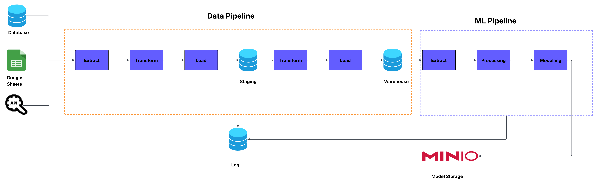

## Project Description

  This project is designed to developed a **Data Pipeline** and **Machine Learning Pipeline**. The transactional data source is scattered across database, Google Sheet, and API . We will create efficient ETL (Extract, Transform, Load) processes into Data Warehouse and prepare use the data for Machine Learning Modelling and dump the model into **MiniO**.

## Prerequisites

  
Before you begin, ensure you have met the following requirements:

- Docker installed on your local machine

### Setup Instructions

1. Clone the repository to your local machine.

2. Navigate to the project directory.
### Running the Project

To build and run the project, execute the following commands in your terminal:

```bash
docker compose build --no-cache
docker compose up -d
```

## Dataset

1. **Source Database (`source_db` container)**  
	- A PostgreSQL database that contains Car Sale transaction data

2. **Google Spreadsheet**  
	- A google spreadsheet that contains Car Brands.

3. API data 
	- An API data contains ID of state, code of state, and name of state.

## Problem Statement

There are several challenges that need to be done before load it into Warehouse. Some of them are:
- Data are spread across multiple sources (Database,API,Google Sheet)
- Data may not be organized in a way that's immediately suitable for machine learning modeling
- Unstructured or poorly organized data
- Identify the data that can be used for supervised or Unsupervised Learning

## Solution

To solve these problems we will do two steps :
1. Exploratory Data Analysis (EDA), to understand the dataset
2. Implement ETL pipeline to move data from different sources
3. When building Data Pipeline there are two layers:
	1. Staging Layer
	2. Warehouse Layer
4. In the Machine Learning Pipeline, we will get the data from Data Warehouse and do the Preprocessing like change data type, splitting data, etc.
5. The model will be used is XGBoost
6. Then the model will be saved in MiniO
7. All the processes information will be stored in Log Database

### Exploratory Data Analysis (EDA)

This step can be seen in file `Data Exploration.ipynb`.

### Data Pipeline & Machine Learning Pipeline Design



The components for this are:
1. Extract data from Source DB, Google sheet, and API
2. Dump data into Staging Database
3. Extract from Staging then transform
4. Dump clean data into Warehouse
5. Extract data from Warehouse
6. Preprocessing data
7. Create Machine Learning model and save the model in MiniO
8. All the process informations are stored in Log Database
